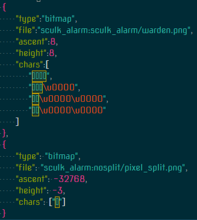

<h1> Sculk Alarm </h1>
<h2> Description </h2>

Small lightweight plugin that allows players to see their alarm level given by triggering sculk shriekers.
Whole mechanic is kinda strange and without research is almost impossible to hold in mind.

 
  
Explanation of the mechanic

On player there is a tag that has both level and time for current "warning level"
After trigger of a shrieker timer resets t0 10 minutes. After this timer runs out level of alarm decreases by 1 and new timer for 600 seconds is set up.
Timer and Level DO NOT reset upon playe deatha and not coordinated to player almost at
all(small difference in adio queue is too subtle for player to notice without listening carefully)

Also has companion resource pack that shows cute warden graphic on the sidebar display
<h2> Installation </h2>
After aquiring plugin just put jar file into the plugins foulder of your server.
After aquiring resource pack:
 1) unzip foulder
 2) navigate into assets foulder and copy sculk_alarm foulder into your resource pack
 3) navigate into minecraft/font foulder
 3.1) in case your server pack does not have "default.json" simply copy and paste it into same directory
 3.2) in case your server pack features "default.json" copy part shown on the screenshot from sculk alarm's resource pack and paste it into your "default.json" providers tag. don't forget to add , after last dictionary in your file :)
 4) you should be ready to use resource pack!
 Part mentioned in step 3.2: 
 
 In case you don't want to use custom resource pack just set 0 at "sidebar-warden-image" tag in config.yml generated by starting server with plugin
<h2> Usage </h2>
Plugin features 2 commands: 
/sa_toggle: allows players to toggle sidebar or chat message ffrom popping up when recovery compass is right-clicked. 
    Usage: /sa_toggle [on|off]* 
    Permission: sculk_alarm.toggle  
/sa_appearance: allows player to choose which output on right-clicking recovery compass they want to see. 
    Usage: /sa_appearance chat|sidebar 
    Permission: sculk_alarm.appearance 

Big thanks to <a href="https://www.spigotmc.org/members/jowcey.87423/"><b>Jowcey</b></a> :D He is some sort of mentor in a whacky adventure of mine. 
Would've never touched Java in my life if not him >.>
 

 
